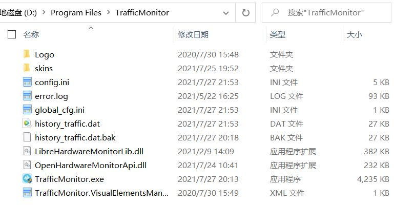

在程序所在目录下，通常会有以下这些文件（夹）：

* TrafficMonitor.exe

  TrafficMonitor的主程序。

* skins

  包含TrafficMonitor的皮肤

* TrafficMonitor.VisualElementsManifest.xml和Logo文件夹

  用来显示固定到Windows10开始屏幕上的磁贴样式。

  如果你的操作系统是Windows8.1及以下，那么这几个文件是没有作用的。

* config.ini

  配置文件，保存了TrafficMonitor的所有设置。

* error.log

  日志文件，里面记录了一些程序的异常信息。

* history_traffic.dat

  历史流量数据文件，里面记录了在“历史统计界面”显示的所有历史流量数据。

  该文件是以文本形式保存的，你可以通过任意一款文本编辑器打开它。其中每一行保存了日期、上传流量和下载流量，其中的流量数据是以KB为单位记录的。

* history_traffic.dat.bak

  自动备份的历史流量数据文件。程序会在退出或你关机的时候自动将history_traffic.dat备份到此文件。

  仅当history_traffic.dat.bak中的记录数量少于history_traffic.dat文件时才会自动备份。

  当载入历史流量数据时，如果history_traffic.dat.bak中的数量比history_traffic.dat多，则说明history_traffic.dat中的数据可能有损坏，此时会从history_traffic.dat.bak中载入历史流量数据。

* global_cfg.ini

  保存配置文件保存位置的配置文件。

  此文件中只有一项“portable_mode”配置。

  当“portable_mode”为false时，config.ini、history_traffic.dat、history_traffic.dat.bak和error.log这几个文件将会保存到“C:\Users\\<用户名>\AppData\Roaming\TrafficMonitor”目录下。

  当“portable_mode”为true时，以上文件将保存到程序所在目录。

  你也可以通过[“选项”——“常规设置”——“配置和数据文件”](选项设置#数据和配置文件)来设置global_cfg.ini中的这个选项。

  程序在启动时会先读取此文件的内容，再根据“portable_mode”的值来决定从哪个位置读取配置和数据文件。

  但是，在以下两种情况下，配置和数据文件会强制保存到“C:\Users\\<用户名>\AppData\Roaming\TrafficMonitor”目录，并且[“选项”——“常规设置”——“配置和数据文件”](选项设置#数据和配置文件)中“保存到程序所在目录”选项将不可用。

  * 当程序所在目录没有写入权限时。
  * 当程序exe文件是在系统临时目录中启动的时候。

* LibreHardwareMonitorLib.dll

  用于实现硬件监控功能的第三方库LibreHardwareMonitor。

  如果LibreHardwareMonitor的作者更新了软件，可以用这个文件的最新版本进行替换，以解决某些硬件监控的问题。

* OpenHardwareMonitorApi.dll

  用于实现TrafficMonitor对LibreHardwareMonitorLib调用的动态库。
