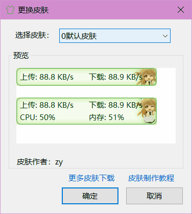
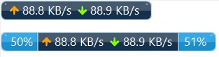

**[简体中文](更换皮肤功能) | English**

Select "More Functions" - "Change Skins" in the main window context menu will open the "Change Skin" dialog.

You can select a skin you like for main window here.

The skin files are saved in the "skins" directory in the program directory. Each skins are placed in the separated folders.

You can [click here](Skin-Making-up-Tutorial) to view the skin making tutorial.

Each skin has tow set of layouts, so there are two previews in the "Preview" of "Change skin" dialog for each skins. As shown in the picture above. When select "Show More Info" in the main window context menu, you can switch between these two layouts.

Some skins contain the font or display text settings, when selecting these skins, you will see "This skin will overwrite  font Settings" or "This skin will overwrite display text settings" at the bottom of the "Preview".

Some skins do not display the label text in front of the value, such as the following skin:

Therefore, the "Swap the position of upload and download" option in "Options" - "Main Window Settings" will not be available when using this skin.