**简体中文 | [English](Option-Settings)**

在右键菜单中选择“选项”命令将弹出选项设置对话框。

选项设置包含三个标签页。

目录
* [主窗口设置](#主窗口设置)
  * [颜色和字体](#颜色和字体)
  * [显示文本](#显示文本)
  * [单位设置](#单位设置)
  * [主窗口其他设置](#主窗口其他设置)
* [任务栏窗口设置](#任务栏窗口设置)
  * [颜色和字体](#颜色和字体-1)
    * **[关于背景颜色和背景透明的说明](#关于背景颜色和背景透明的说明)**
  * [显示文本](#显示文本-1)
  * [单位设置](#单位设置-1)
  * [任务栏窗口中的其他设置](#任务栏窗口中的其他设置)
* [常规设置](#常规设置)
  * [应用程序设置](#应用程序设置)
  * [数据和配置文件](#数据和配置文件)
  * [通知消息](#通知消息)
  * [硬件监控](#硬件监控)
  * [高级](#高级)
  * [皮肤](#皮肤)

### 主窗口设置

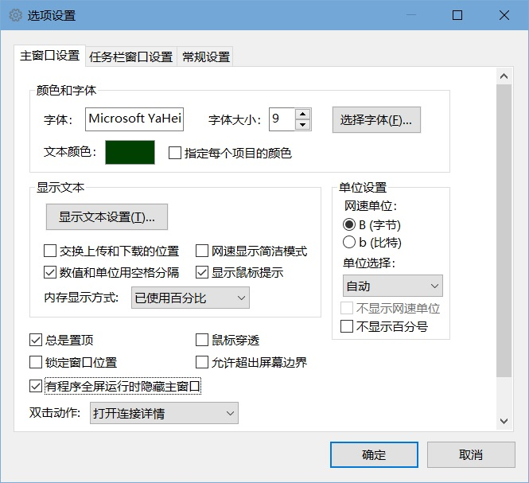

#### 颜色和字体

* 字体

  这里可以设置主窗口显示文本的字型、字体大小。

  点击“选择字体”按钮可以弹出“字体”对话框，在这里还可以设置字体的样式，包括粗体、斜体、下划线、删除线的字体样式。

  你无法通过“字体”对话框设置文本颜色。

* 文本颜色

  点击“文本颜色”右侧的颜色矩形框会弹出颜色对话框，可以更改主窗口显示文本的颜色。

  如果勾选了“指定每个项目的颜色”，则点击颜色矩形框会弹出“主窗口颜色设置对话框”，可以单独设置每一项的颜色。如下图所示。

  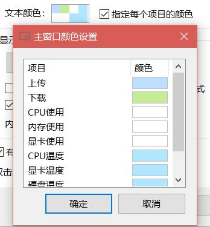

  此时，列表中的“颜色”一列会显示每一项的文本颜色。双击“颜色”列中的矩形色块可以更改对应项的文本颜色。

  更改文本颜色后的效果如下：

  

  注意，主窗口的字体和文本颜色可能会被使用的皮肤所更改。如果你不希望这些设置被皮肤更改，可能在“选项设置”——“常规设置”——“皮肤”中进行设置。

#### 显示文本

* 显示文本设置

  点击“显示文本设置”按钮会弹出“显示文本设置”对话框，在这里可以设置主窗口中每一项前面的文本。如下图所示：

  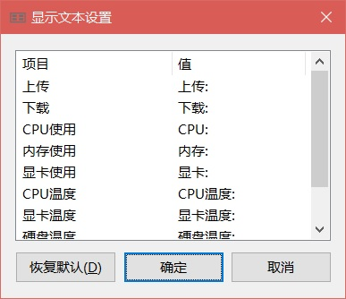

  双击列表中“值”一列可以编辑对应项的显示文本。

  点击“恢复默认”可以恢复默认的值。

  注意，由于某些皮肤不显示每一项前面的文本，因此当使用这些皮肤时“显示文本设置”按钮可能会是不可用的。

* 交换上传和下载的位置

  勾选此项可以让上传和下载的位置交换。

  注意，对于那些不显示每一项的文本的皮肤，此选项也会是不可用的。

* 网速显示简洁模式

  这个选项可以让网速显示避免占用更多的字符。勾选后，网速的小数位数将减少1，同时，当网速单位设置为B（字节）时不显示B。如下图所示。

  

* 数值和单位使用空格分隔

  勾选后，数值和单位会使用一个空格分隔。

* 显示鼠标提示

  勾选后，鼠标指向主窗口时会显示一个鼠标提示。
  
* 内存显示方式

  可以设置内存利用率的显示方式。

  * 已使用百分比

    以百分比的形式显示当前内存利用率。

  * 内存已使用

    直接显示已使用内存的数值。

  * 内存可用

    直接显示可用内存的数值。

#### 单位设置

* 网速单位

  可以选择网速显示的单位，有 B（字节）和 b（比特）两个选项。

  使用b（比特）为单位时的数值将比使用B（字节）为单位时大8倍。

* 单位选择

  可以选择“自动”、“固定为KB/s”和“固定为MB/s”。

  当选择“自动”时，会根据当前网速值自动选择网速单位。小于1024K时将使用K为单位，超过1024K时则使用M为单位。

* 不显示网速单位

  如果上面的“单位选择”设置为“自动”，则此项不可用。

  勾选此项时，网速单位将被隐藏。

* 不显示百分号

  勾选此项时，CPU和内存利用率后面的百分号将被隐藏。

#### 主窗口其他设置

* 总是置顶

  勾选此项后，主窗口将总是置于其他窗口的上方。

  但是如果其他窗口同样具有置顶属性，则TrafficMonitor的主窗口并不一定能置于其他窗口的上方。

  为了防止置顶属性失效，如果设置了总是置顶，程序每隔一段时间会自动执行一个置顶操作。

* 鼠标穿透

  勾选此项后，主窗口将无法响应鼠标消息，也无法右击弹出菜单。

  勾选此项后可以使主窗口不会影响在其他程序中的操作。

  如果要取消鼠标穿透，可以在通知区图标中单击鼠标右键，在右键菜单中取消鼠标穿透。

* 锁定窗口位置

  勾选此项后，主窗口位置将无法被拖动。

* 允许超出屏幕边界

  默认情况下，主窗口不允许被移出屏幕之外，勾选此项后则不再有此限制。

* 有程序全屏运行时隐藏主窗口

  勾选此项后，如果有其他窗口占满了整个屏幕，则主窗口会自动隐藏。

* 双击动作

  在这里可以设置双击主窗口后将执行什么操作。

  如果在这里选择“打开指定应用程序”，则下面会显示“指定应用程序”的控件，可以选择双击后将打开哪个应用程序。

  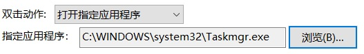


### 任务栏窗口设置

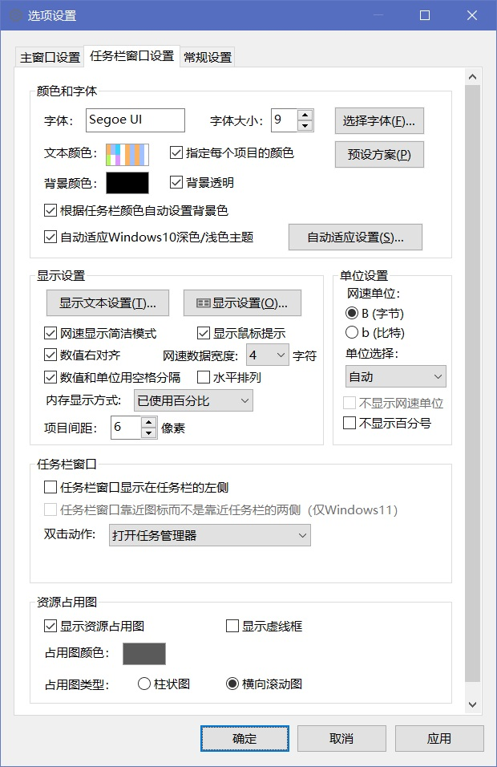

#### 颜色和字体

* 字体

  这里可以设置任务栏窗口显示文本的字型、字体大小。

  点击“选择字体”按钮可以弹出“字体”对话框，在这里还可以设置字体的样式，包括粗体、斜体、下划线、删除线的字体样式。

  你无法通过“字体”对话框设置文本颜色。

* 文本颜色

  这个选项和“主窗口设置”中文本颜色选项一样。如果勾选了“指定每个项目的颜色”，则点击后会弹出“任务栏窗口颜色设置”对话框，如图所示：

  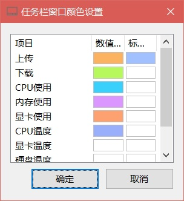

  任务栏窗口文本颜色允许为每一项的标签和数据设置不同的颜色。

  双击“标签颜色”或“数值颜色”列中的色块可以设置对应项的标签和数值颜色。

* 背景颜色

  这里可以设置任务栏窗口的背景色

* 背景透明

  勾选此项后可以使用背景透明。在Windows10深色和浅色模式下，此选项的效果略有不同。

* ##### 关于背景颜色和背景透明的说明

  * **深色Windows模式下**

      如果你当前的Windows颜色模式为深色，那么你应该将背景颜色设置为纯黑色（RGB：0,0,0），再将“背景透明”勾选上，此时便可获得最佳的显示效果。如图所示：
      
      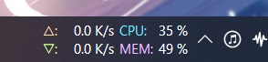
      
      在保持“背景透明”勾选的情况下，将背景颜色设置为纯黑色以外的颜色时，任务栏窗口仍然保持和任务栏一样的亚克力半透明效果，如图所示：
      
      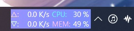
    
      其原因似乎是，在深色Windows模式下，任务栏的子窗口中颜色的亮度值会被映射为不透明度，因此，黑色的背景或文字会被处理为完全透明。
      
      如果你去掉“背景透明”的勾选，那么此时任务栏窗口将变成完全不透明的状态：
      
      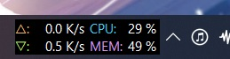
      
  * **浅色Windows模式下**
  
      在浅色Windows模式，如果使用深色模式下的设置，即将背景色设置为纯黑色，文字设置为白色，会导致任务栏窗口颜色看不清：
      
      
      
      因为黑色的背景色被映射为完全透明，而文字又是白色，因此就会看不清。而你又无法将文字设置为黑色，因为黑色的文字仍然会被映射为完全透明。
      
      在浅色Windows模式下，你应该将背景色设置成一个纯黑色以外的颜色，并建议设置为和任务栏相近的颜色。
      
      你可以在点击“背景颜色”右侧的矩形框，弹出“颜色”对话框后，点击“选择”按钮，选取一个任务栏上的颜色作为背景色，如下图所示：
      
      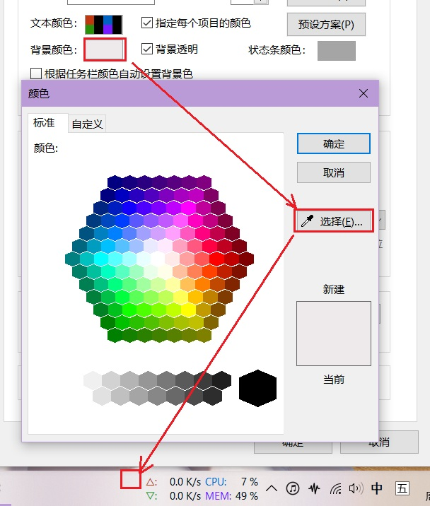
      
      如果不勾选“背景透明”，那么，任务栏窗口背景将以不透明效果显示。
      
      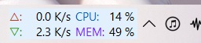
  
* 预设方案

  点击此按钮后会弹出一个菜单，如图所示：

  

  默认情况下，预设1、预设2和预设3都是黑色背景白色文字的配色，适用于深色Windows模式。预设4为浅色背景黑色文字的配色，适用于浅色Windows模式。你可以将自己定义的配色保存到这4个预设中。

  当你设置好一套文本颜色、背景颜色等设置时，选择“修改预设方案”子菜单下的一项，可以将当前颜色设置保存到选择的预设中，此时会弹出一个提示信息，如下图所示：

  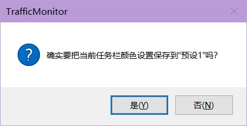

  选择“是”之后，当前颜色设置便保存到对应的预设中了。

  在“预设方案”菜单下选择对应的预设就可以将该预设应用到设置中来。

* 根据任务栏颜色自动设置背景色

  此功能主要针对浅色Windows模式提供。勾选此项后，程序会选取任务栏中的一个颜色作为背景色，即自动完成了上面提到的手动选取任务栏颜色的操作。

  此功能在背景色设置为纯黑色时无效。

* 自动适应Windows10深色/浅色主题

  此功能可以在Windows10深色/浅色模式变化时自动应用设定好的预设方案。

  点击“自动适应设置”可以配置在Windows10深色/浅色模式下分别使用哪种预设方案。

  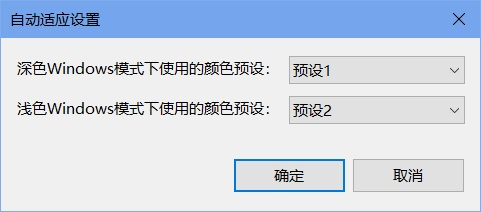

  在使用此功能时，你可以在深色和浅色Windows模式下分别配置好一种预设，再在这里为深色和浅色Windows模式设置对应的预设。

#### 显示设置

* 显示文本设置

  点击“显示文本设置”按钮可以设置任务栏窗口中每一项前面的文本。点击“恢复默认”可以恢复默认的值。

* 显示设置

  点击“显示设置”按钮可以设置在任务栏窗口中显示的项目，以及对这些项目排序。如下图所示：

  

* 网速显示简洁模式

  这个选项可以让网速显示避免占用更多的字符。勾选后，网速的小数位数将减少1，同时，当网速单位设置为B（字节）时不显示B。如下图所示。

  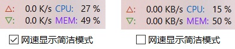

* 显示鼠标提示

  勾选后，鼠标指向任务栏窗口时会显示一个鼠标提示。

* 数值右对齐

  勾选后，任务栏显示的数值将以右对齐方式显示。

* 水平排列

  勾选后，任务栏窗口中的各项将以水平方式排列，如图所示：

  

  如果你的任务栏使用了“小任务栏按钮”，那么使用水平排列布局可以使得任务栏窗口在垂直方向不会过于拥挤。

  当任务栏处于屏幕的两侧时此选项无效。

* 数值和单位使用空格分隔

  勾选后，数值和单位会使用一个空格分隔。

* 网速数据宽度

  这里可以设置网速数据宽度占用的字符数。如果你出现网速显示不完全的问题可以把这个数值调大。

* 内存显示方式
  
  可以设置内存利用率的显示方式。
  
  * 已使用百分比
  
    以百分比的形式显示当前内存利用率。
  
  * 内存已使用
  
    直接显示已使用内存的数值。
  
  * 内存可用
  
    直接显示可用内存的数值。
  
* 项目间距

  可以设置任务栏窗口显示项目之间的水平间距。

  如果任务栏在桌面的两侧，则这个值为项目之间的垂直间距。

#### 单位设置

任务栏窗口的单位和主窗口中对应的设置完全一样，详细说明请参照前面“主窗口设置”中“[单位设置](#单位设置)”部分。

#### 任务栏窗口设置

* 任务栏窗口显示在任务栏的左侧

  勾选此项后，任务栏窗口将显示在任务栏的左侧，如图所示：

  

  注意：在Windows11中，只有当任务栏的对齐方式为“居中”时，此选项才有效果。

  在Windows11中，勾选了此项时，为了避免和系统自带的小组件重叠，任务栏窗口距离任务栏的最左侧会有一定的距离。如下图所示：

  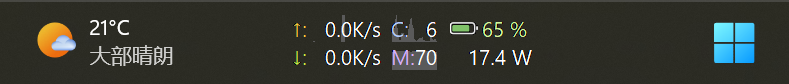

  如果你想手动调整这个距离，可以通过修改配置文件`config.ini`中的设置来实现：

  ```ini
  [task_bar]
  taskbar_left_space_win11 = 160
  ```

* 任务栏窗口靠近图标而不是靠近任务栏两侧

  此选项仅在Windows11中可用，效果如下图所示：

  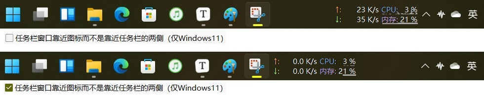

* 双击动作

  在这里可以设置双击任务栏窗口后将执行什么操作。

  如果在这里选择“打开指定应用程序”，则下面会显示“指定应用程序”的控件，可以选择双击后将打开哪个应用程序。
  
  

#### 资源占用图

* 显示资源占用图

  勾选后，任务栏CPU、内存等项目的背景中会显示一个表示对应项目资源占用情况的图形，如图所示：

  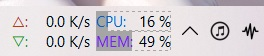
  
* 显示虚线框

  勾选后，会在任务栏CPU、内存等项目上显示虚线框。

* 显示网速占用图

  勾选后，任务栏的上传、下载项目的背景中会显示表示对应网速情况的图形。

* 网速占用图示的最大值

  这里设置网速占用图能够表示的最大网速。

* 占用图颜色

  这里可以设置占用图的颜色。

* 占用图类型

  你可以在这里选择资源占用图显示的类型。默认为柱状图，如果设置为横向滚动图，会显示CPU/内存等随时间变化的情况，如下图所示：

  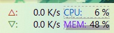

### 常规设置

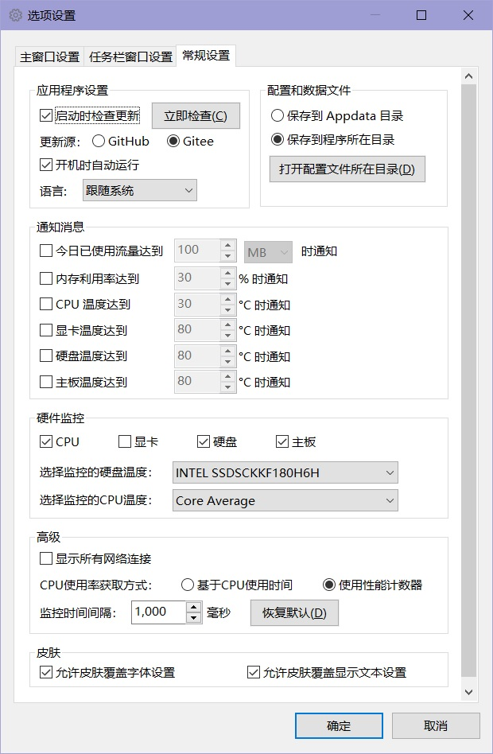

#### 应用程序设置

* 启动时检查更新

  勾选此项时，程序在启动时会在后台检查是否有更新，如果有则会弹出更新提示。

  点击“立即检查”按钮可以立即执行一次检查更新。

* 更新源

  可以设置更新源为GitHub或Gitee。由于GitHub在中国大陆访问比较缓慢，会导致经常出现检查失败的问题，因此建议国内用户将更新源设置为Gitee。

  如果TrafficMonitor的语言设置为简体中文，则默认的更新源为Gitee。

* 开机自动运行

  勾选后，程序将会在Windows启动后自动运行。

  * 对于1.80版本以前的版本和1.80版本以后Lite版本，程序是通过在注册表`计算机\HKEY_CURRENT_USER\SOFTWARE\Microsoft\Windows\CurrentVersion\Run`下面添加一个启动项来实现开机自启动功能的。如果你遇到开机自启动功能不正常的问题，可以检查一下该注册表路径是否有TrafficMonitor的开机自启动项。

  * 对于1.80版本以后标准版本，程序是通过任务计划来实现开机自启动的。如下图所示：

    

    如果你遇到开机自启动功能不正常的问题，请检查任务计划中TrafficMonitor的启动项是否被创建，以及exe文件的路径是否正确。

* 重新设置开机自动运行

  点击此按钮，会为当前TrafficMonitor进程重新设置一次开机自动运行。当开机自动进行功能不正常时可以尝试点击此按钮。

  如果“开机自动运行”没有被勾选，点击此按钮后会自动勾选。

* 语言

  这里可以更改TrafficMonitor的显示语言。需要重新启动软件才能生效。

#### 数据和配置文件

这里设置程序的配置文件和历史流量统计数据文件的保存位置，默认放在程序所在目录。你可以点击“打开配置文件所在目录”按钮在资源管理器查看程序的配置文件。

关于数据和配置文件的详细说明请参见“[配置和数据文件](配置和数据文件)”章节。

#### 通知消息

* 今日已使用流量超过xxx时通知。

  勾选此项可以让TrafficMonitor在当前流量超过设置的数值时弹出通知，如下图所示：

  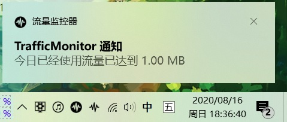
  
* 内存利用率达到xxx%时通知

  勾选此项可以让TrafficMonitor在内存利用率达到指定数值时弹出通知。

* xxx温度达到xxx°C时通知

  勾选这些项目可以让TrafficMonitor在对应硬件的温度达到指定值时弹出通知。

  如果没有在“硬件监控”中开启对应的监控项目，或者你使用的是Lite版的TrafficMonitor，则这里的选项将不可用。

#### 硬件监控

在这里可以开启或关闭硬件监控功能。硬件监控功能是默认关闭的，如果你需要使用TrafficMonitor显示温度、显卡利用率及其他硬件信息信息，可以在这里开启对应的硬件监控项。

注意：如果你使用的是Lite版本，则这里的所有选项都被禁用的。

* CPU

  开启此项可以开启CPU温度、CPU频率监控功能。

* 显卡

  开启此项可以开启显卡温度和显卡利用率监控功能。

* 硬盘

  开启此项可以开启硬盘温度和硬盘利用率监控功能。

* 主板

  开启此项可以开启主板温度监控功能。

注意：当某一项监控功能被关闭时，任务栏右键菜单的”显示设置“中将不会显示对应的项目，如下图所示：

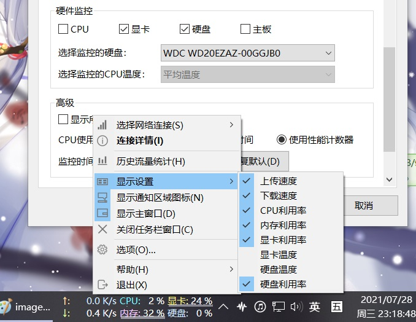

在上图中，由于硬件监控中的”CPU“和“主板”被关闭，因此任务栏右键菜单中“显示设置”中将不会显示“CPU温度”和“主板温度”。

* 选择监控的硬盘

  如果你的电脑中有多个硬盘，可以在这里选择要显示哪块硬盘的温度和利用率。

* 选择监控的CPU温度

  在这里可以选择要监控哪个CPU核心的温度。

  如果选择第一项”平均温度“，则显示的CPU温度为从第二项开始所有温度的平均值。

硬件监控功能使用了第三方库[LibreHardwareMonitor](https://github.com/LibreHardwareMonitor/LibreHardwareMonitor)。据部分用户反馈，开启硬件监控功能会导致一些问题，例如CPU占用异常、电脑死机等。如果没有硬件监控的需要，建议**不要**开启此功能。当开启任意一项硬件监控功能时，都会弹出一个提示对话框，如下图所示：

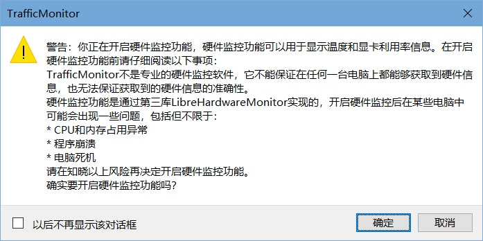

#### 高级

* 显示所有网络连接

  勾选后，在右键菜单的“选择网络连接”子菜单下会显示出所有获取到的连接。如果没有特殊的需要，建议不要开启此项。

  开启此项后，“选择网络连接”子菜单下的“选择全部”将不可用，因为此时会有重复的网络连接。

* 选择要监控的网络连接

  点击此按钮后，会弹出“选择要监控的网络连接”对话框。

  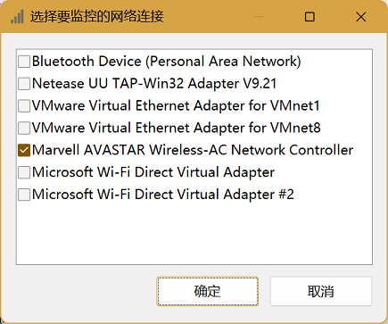

  默认情况下，此对话框中的所有项目处于被勾选状态。

  如果去掉这里某些项目的勾选，那么这些未被勾选的网络连接将不会出现在右键菜单“选择网络连接”的子菜单中。

  如果你的电脑经常出现网速显示不正常的问题，可以尝试在这里去掉你不感兴趣的网络连接的勾选。

* CPU使用率获取方式

  * 基于CPU使用时间

    默认选择此项。通过`GetSystemTimes`函数来计算CPU使用率。

  *  使用性能计数器

    选择此项时，将使用性能计数器来获取CPU使用率。
    
    在Windows10及以后的操作系统中，如果选择“基于CPU使用时间”会导致显示的CPU利用率和系统任务管理上的不一致。如果你希望它和任务管理器中的一致，可以选择“使用性能计数器”选项。
    
    在Windows10以下的操作系统中，选择这两项得到的CPU利用率并没有区别。
  
* 监控时间间隔

  这里可以设置TrafficMonitor监控信息刷新的时间间隔。默认为1000毫秒。

* 插件管理

  点击此按钮会弹出插件管理对话框。

  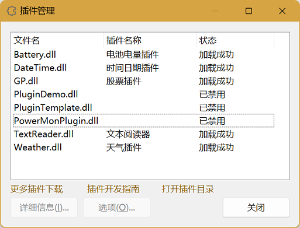

  在这里可以查看和管理所有插件信息。

  关于插件功能的详细说明请参见[插件功能](插件功能)。

#### 显示

* 显示通知区图标

  勾选此项可以显示通知区图标。

  关于通知区图标的详细说明请参见“[通知区图标](通知区图标)”章节。

#### 皮肤

这里可以选择是否允许皮肤更改主窗口的某些设置。