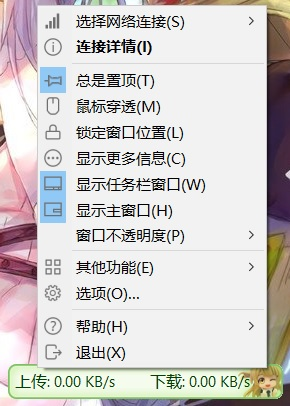
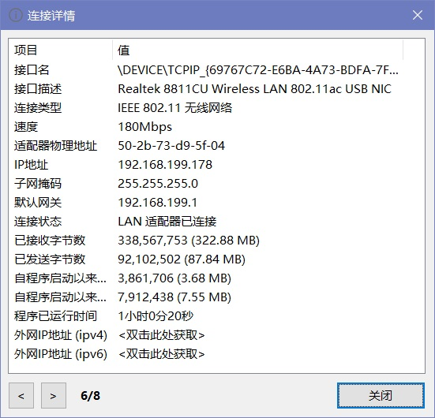
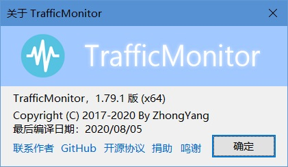
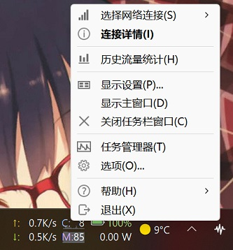
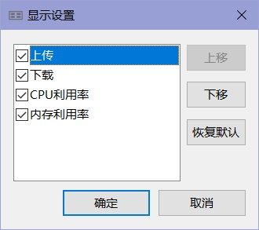

**[简体中文](右键菜单) | English**

There are tow context menu in TrafficMonitor, main window context menu and taskbar window context menu.

Right click the notification area icon will bring up a context menu, but it is exactly the same as the main window context menu.

### Main window context menu

Right click the main window or the notification area icon will bring a context menu as shown above.

The explanation of each menu item is as following:

* Select network connections

  There are several submenus under this menu item. You can select the network connection you want to monitored. You can also select "Auto select" or "Select all". For the detail explanation of selection network connections, please refer to [Select the Monitoring Network Connections](Select-the-Monitoring-Network-Connections) section.

* Connection details

  Click this command will bring up Connection details dialog box. You can check the detail information of current monitored connection here.

  

  You can switch the connection details in all connections by click "<" and ">" button. If the information displayed is the current monitored connection, the number "x/x" on the bottom left corner will be show in bold. 

  The last three items -- "program elapsed Time", "Internet IP Address (ipv4)", and "Internet IP Address (ipv6)" -- are independent of the network connection selected.

  Internet IP addresses are not displayed by default. They need to double-clicked to obtain.

* Always on top

  When this item is checked, the main window will always be placed above the other windows.

  But the main window of TrafficMonitor may not necessarily be placed above other windows if they also have the top property.

  To prevent the top property from failing, if "Always on top" is set, the program will automatically perform the top property every once in a while.

* Mouse Penetrate

  When this item is checked, the main window will not respond any mouse messages, and the context menu will not be popup by right click.

  This option can make the main window does not affect operations in other programs.

  If you want to cancel mouse penetrate, you can right click the notify icon, uncheck mouse penetrate in the context menu.

* Lock Window Position

  When this item is checked, the main window cannot be dragged to move.

* Show More Info

  When this item is checked, the CPU and memory usage can be shown in the main window.

  Note: the information displayed after this item is check is related to the skin you are using. Each TrafficMonitor skin has two layouts. Checking this item actually switches between two layouts. Please refer to [Change Skin Function](Change-Skin-Function) section for details.
  
* Show Taskbar Window

  When this item is check, the taskbar window of TrafficMonitor will be displayed on the taskbar.

  Please refer to [Taskbar Window](Taskbar-Window) section for details on taskbar window.

* Show Main Window

  This item is checked by default. When this item is unchecked, the main window will be hidden. If you want it to display again, you can right click the notify icon, or right click the taskbar window, recheck "Show Main Window" in the context menu.

* Window Opacity

  Here you can set the opacity of the main window.

* Other functions

  * Change skin

    The "Change skin" dialog box will be bring up by selecting this command.

    Please refer to [Change Skin Function](Change-Skin-Function) section for details on changing skins.

  * Change notify icon

    The "Change notify icon" dialog box will be bring up by selecting this command. You can change the style of the  notify icon.

    Please refer to [通知区图标](通知区图标) section for details on change notify function.

  * Allow out of Screen Boundaries

    By default, the main window is not allow to be moved out of the screen, after this item is check, this restriction is removed.

  * Historical Traffic Statistics 

    The "Historical Traffic Statistics" dialog box will be bring up by selecting this command. The traffic you used can be shown in this dialog.

    Please refer to [历史流量统计](历史流量统计) section for details on historical traffic statistics function. 
    
  * Plugin-in Manage

    The "Plugin-in Manage" dialog box will be bring up by selecting this command, you can manager the loaded plugins here.

    Please refer to [插件功能](插件功能) section for details on plugin function.
    
  
* Options

  The "Option Settings" dialog box will be bring up by selecting this command. You can change the settings in TrafficMonitor.

  Please refer to [Option Settings](Option-Settings) section for details on the meaning of the options.

  Note: if you right click the plugin item area, selecting this command will bring up the option dialog for the corresponding plugin, not TrafficMonitor.

* Help

  * Help

    Show the help page in TrafficMonitor Wiki.

  * About

    Show "About" dialog box.

    
  
* Exit
  
  Exit TrafficMonitor.
  

### Taskbar window context menu

Right click in the taskbar window will bring up the context menu shown in the image above.

* Display Settings

  The "Display Settings" dialog box will be bring up by selecting this command. You can check the items you want to displayed in the taskbar.

  

* Close Taskbar Window

  The taskbar window will be closed by selecting this command, but not exit the program.

  To display the taskbar window again, please right click the main window or the notify icon, and check "Show Taskbar Window".

* Task Manager

  You can open Windows Task Manager by selecting this command. Note that if you use TrafficMonitor 32-bit on a 64-bit Windows, you can only open the 32-bit Task Manager. This is the limitation of Windows.

Other commands on taskbar window context menu is the same with which on main window. Please refer to [Main window context menu](Context-Menu#Main-window-context-menu).

Please refer to [Taskbar Window](Taskbar-Window) for details.