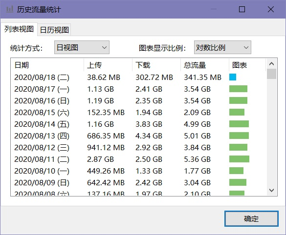
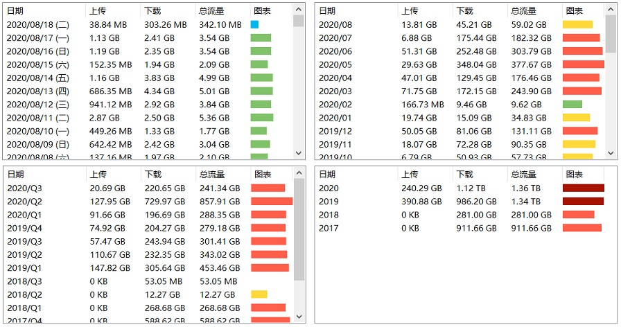
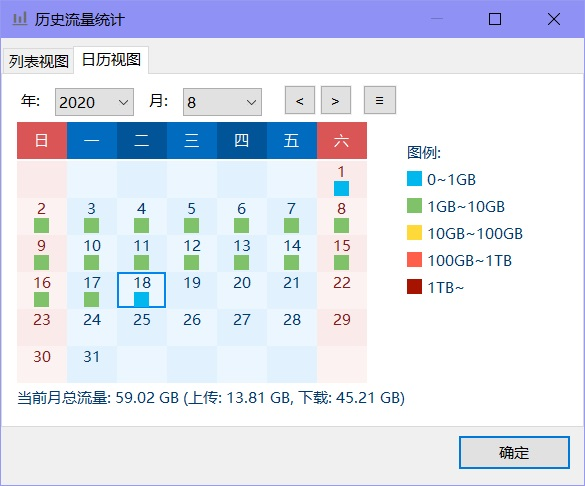
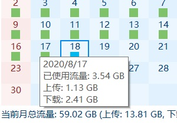
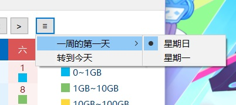

在主窗口右键菜单中选择“其他功能”——“历史流量统计”，或者在任务栏窗口右键菜单中选择“历史流量统计”可以打开历史流量统计对话框。

在这里，你可以查看你每一天的历史流量记录。

在历史流量统计对话框包含“列表视图”和“日历视图”两个标签页。

#### 列表视图

在列表视图中，你可以以列表的形式查看以往每一天的历史流量记录。

列表中列出了每一天的上传、下载和总流量的数据。

最后一列“图表”以柱形图的方式直观地展示了流量的大小。其中，根据使用流量数据的多少，柱形图会以不同颜色显示。不同颜色代表的含义如“日历视图”中的“图例”所示。

* 统计方式

  在“统计方式”下拉列表中可以选择此视图中的统计方式。下图分别为“日视图”、“月视图”、“季视图”和“年视图”下的界面。

  

* 图表显示比例

  * 线性比例

    使用线性比例时，“图表”一列中的柱形图的长度与该行流量数成一次函数比例。

  * 对数比例

    使用对数比例时，“图表”一列中的柱形图的长度与该行流量数成对数函数比例。

  使用对数比例时，可以使得当列表中流量大小差异较大时，柱形图的长度的差异不至于过大。

#### 日历视图

在日历视图中，你可以以日历的形式查看以往每一天的流量数据。

通过日历上方的下拉框和按钮，你可以自由查看以往每一个月的日历数据。

日历中每一个日期下有一个不同颜色正方形，其中的颜色代表了不同的流量数值，如右侧的“图例”所示。

当你用鼠标指向日历中的一个单元格时，会弹出一个鼠标提示以显示该日期的详细流量数据，如图所示：

点击日历上方最右侧的“≡”按钮会弹出一个菜单：

* 一周的第一天

  可以选择日历的第一列是星期日还是星期一。

* 转到今天

  可以快速跳转到当前的日期。