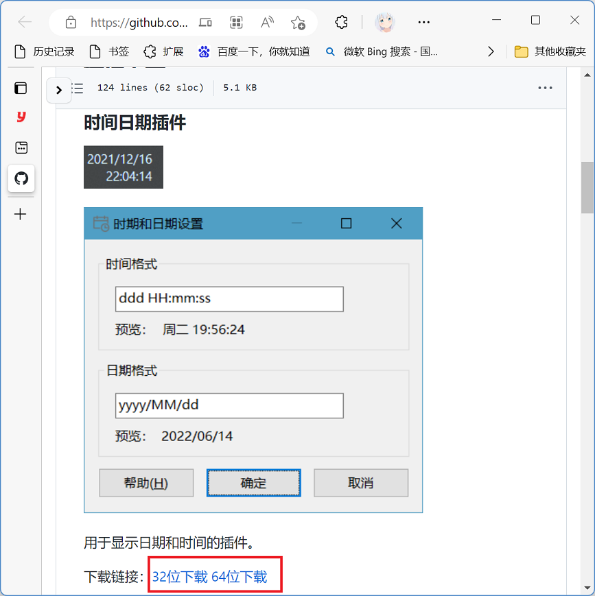
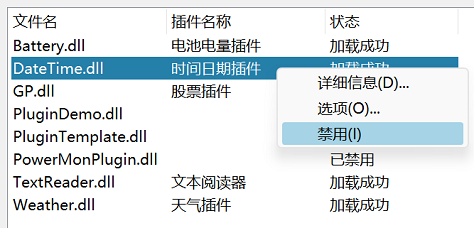

自1.82版开始增加插件系统，利用插件可以在任务栏窗口和主窗口显示更多项目。

## 插件下载和使用

请[点击此处](https://github.com/zhongyang219/TrafficMonitorPlugins/blob/main/download/plugin_download.md)转到插件下载页面下载你需要的TrafficMonitor插件。



如上图所示，根据使用的TrafficMonitor的版本（x86为32位，x64为64位）下载对应版本的插件。

> 由于GitHub在中国大陆地区有时会无法访问或者下载失败，对于中国大陆地区的用户，你可以点击以下链接转到Gitee上的仓库：
>
> [TrafficMonitorPlugins: 用于TrafficMonitor的插件 (gitee.com)](https://gitee.com/zhongyang219/TrafficMonitorPlugins)
>
> 点击“克隆/下载” > “下载zip”，将整个仓库下载到本地，解压后在`download`目录下找到需要的插件。

下载后解压可得到dll文件，下载后将插件dll放到TrafficMonitor程序所在目录下的`plugins`目录下：


重新启动TrafficMonitor后可以在“选项”——“常规设置”——“插件管理”中看到所有的插件：


### 插件管理对话框

插件管理对话框如上图所示，这里可以看到`plugins`目录下所有的插件。

#### 插件详细信息

选中一个插件后点击“详细信息”按钮可以弹出“插件详细信息”对话框。


对话框中每个项目的说明如下：

* 文件名

  插件的文件名。

* 文件路径

  插件文件的完整路径。

* 名称

  插件的名称。

* 描述

  关于插件功能的简要描述。

* 显示项目个数

  一个插件允许有多个显示项目。例如上图中的日间日期插件提供了“时间”、“日期”和“自绘示例”三个显示项目。

  当插件被正确加载后，插件的所有项目都会被显示到任务栏窗口右键菜单“显示设置”的列表中。

* 显示项目名称

  所有显示项目的名称，每个显示项目的名称使用半角分号隔开。

  这个名称将显示在TrafficMonitor任务栏右键菜单“显示设置”对话框中，以及选项设置对话框中的“主窗口设置”和“任务栏窗口设置”中的“显示设置”对话框和文本颜色设置对话框中。

* 显示项目ID

  所有显示的唯一标识符，每个显示项目的ID使用半角分号隔开。

* 作者

  插件的作者。

* 版权

  插件的版权信息。

* 版本

  插件的版本号。

* 接口版本

  该插件使用的TrafficMonitor插件接口的版本。随着TrafficMonitor插件接口版本的更新，使用旧版本接口开发的插件可能会无法使用。

#### 插件选项

选中一个插件后点击“选项”按钮可以弹出该插件的选项对话框。此对话框由插件开发者提供。因此每个插件的选项对话框都不尽相同。

在主窗口或任务栏窗口的插件项目区域点击鼠标右键，在弹出的右键菜单中选择“选项”，会弹出对应插件的选项对话框，而不是TrafficMonitor的选项对话框。

### 在任务栏窗口中显示插件

要使插件项目显示到任务栏中，请在任务栏窗口上点击鼠标右键，选择“显示设置”。


此时，“显示设置”中会显示已加载的插件项目，勾选你希望显示在任务栏上的项目，点击确定即可。

### 在主窗口中显示插件

主窗口中的显示项目只能通过皮肤来指定。

在皮肤的xml文件中的根节点`root`下面添加`plugin_map`节点，如下所示。

```xml
<plugin_map>
  <time>ra1YX2g1</time>
  <cosutom_item>b4zc373y</cosutom_item>
</plugin_map>
```

`plugin_map`节点下面的节点为你需要显示的插件显示项目，节点的值为插件显示项目的ID。

然后就可以在`layout_l`和`layout_s`节点下添加插件项目了。

```xml
<layout text_height="20" no_label="0">
  <layout_l width="232" height="107">
    <cpu x="14" y="3" width="106" align="0" show="1"/>
    <memory x="88" y="3" width="106" align="0" show="1"/>
    ...
    <time x="142" y="57" width="94" align="0" show="1"/>
    <cosutom_item x="142" y="83" width="90" align="0" show="1"/>
  </layout_l>
  <layout_s width="232" height="50">
    ...
  </layout_s>
</layout>

```

关于如何编辑和制作TrafficMonitor皮肤的详细说明请参见[皮肤制作教程](皮肤制作教程)。

### 禁用插件

默认情况下，所有可用的插件都会被加载。如果不想使用某些插件但是不希望将它从磁盘中删除，你可以将它们禁用。

在插件管理对话框中，选中要禁用的插件，点击鼠标右键，在右键菜单中选择“禁用”，此时“禁用”菜单项将处于勾选状态。如下图所示：



在下次启动TrafficMonitor时，被禁用的插件将不会被加载，“插件管理”对话框中“状态”一列显示为“已禁用”。

要再次启用插件，在右键菜单中去掉“禁用”的勾选，下次启动TrafficMonitor时，该插件就会重新被加载。