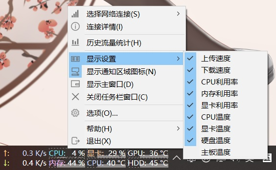
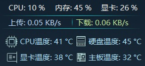

**[简体中文](硬件监控功能) | English**

The hardware monitoring function has been added since version 1.80, including the temperature monitoring of the CPU, GPU, hard disk and main board, and GPU usage monitoring function.

You can enable the display of these items in the context menu of the taskbar, as shown in the picture bellow:

A new skin (皮肤12) has been added for the main window. The hardware monitoring information can be displayed in this skin. As shown in the picture bellow:

It is to be noticed that by default, the hardware monitoring function is disabled. If you need the hardware monitoring function, you need to enable it in [Option Settings - General Settings](Option-Settings#General-Settings).

Please refer to  [Option Settings - General Settings - Hardware Monitoring](Option-Settings#Hardware-Monitoring) for details on hardware monitoring function.

