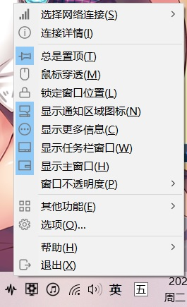
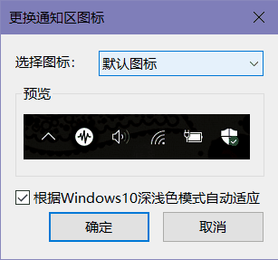

#### 通知区图标

当TrafficMonitor正在运行时，会在系统通知区添加一个图标。

右击此图标会弹出右键菜单。该菜单和主窗口右键菜单是相同的。

在此图标上双击鼠标左键会显示主窗口。

通知图标可以被隐藏。你只需要在主窗口或通知区图标右键菜单中去掉“显示更多信息”的勾选即可。

需要注意的是，如果你去掉了“显示通知区图标”的勾选，并且去掉了“显示主窗口”的勾选，那么通知区图标会自动显示出来。因为如果不这么做的话，你将再也无法弹出右键菜单了。

另外，如果你在[“选项设置”——“常规设置”——“通知消息”](选项设置#通知消息)中设置了通知，当TrafficMonitor弹出通知时，通知图标也会自动显示出来，这是Windows的限制。

事实上，在以下情况下，通知图标会自动显示出来，并且此时“显示通知区图标”将处于灰色禁用的状态。

* 不显示任务栏窗口的情况下开启鼠标穿透后。
* 不显示任务栏窗口的情况下隐藏主窗口后。
* 隐藏主窗口的情况下关闭任务栏窗口后。
* 开启鼠标穿透的情况下关闭任务栏窗口后。

#### 更换通知区图标样式

你可以为通知区图标更换样式。

在主窗口右键菜单中选择“其他功能”——“更换通知区图标”，可以打开“更换通知区图标”对话框。

目前共有6个图标可供选择。

勾选“根据Windows10深色/浅色模式自动适应”选项后，如果你使用的是单色图标，那么当Windows10深色/浅色模式发生变化时，会自动切换为合适的图标。即在深色主题模式下使用白色图标，在浅色主题模式使用黑色图标。