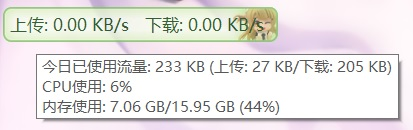

**[简体中文](主窗口) | English**

### TrafficMonitor main window description (desktop suspension window)

When TrafficMonitor is started for the first time, it will display a suspension window as shown below on the desktop:

By default, only upload and download speeds are displayed.

If you want to display CPU and memory usage, you can right click on the main window and select "Show More Info" from the context menu.

When you point at it with your mouse, a tool tip will be displayed:

The tool tip displays the used traffic today, detailed memory usage, and other information not displayed in the main window.

If you don't want to display this tool tip, you can close the mouse tool tip in [Option settings - Main window settings](Option-Settings#Main-Window-Settings). Please refer to the chapter [Main window settings](Option-Settings#Main-Window-Settings) in Option Settings for detail.