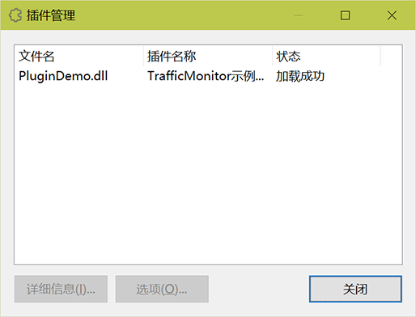
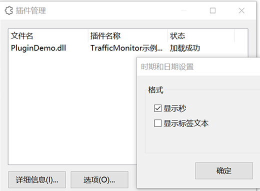
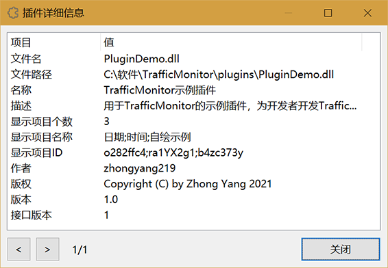
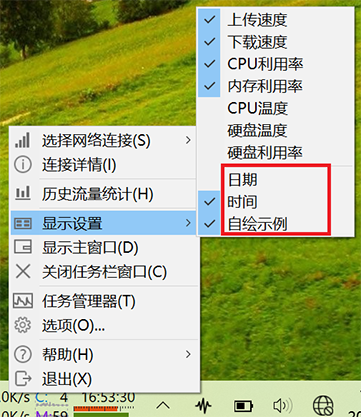

**[简体中文](插件开发指南) | English**

Starting from version 1.82, TrafficMonitor supports the plug-in system and you can develop the plug-ins for TrafficMonitor by yourself.

Plug-ins can be used to display custom items in the taskbar and main window, such as time, date, weather, stocks and other information.

For the plug-in you write to work, you must follow the specifications described in this article.

# Ready to work

To develop a plug-in for TrafficMonitor, you must understand how to write a C++ program first, because the plug-in of TrafficMonitor provides the C++ interface.

Although TrafficMonitor is developed using MFC, this does not mean that TrafficMonitor plug-ins must also use MFC. The interface of the TrafficMonitor plug-in does not contain any UI library classes. Therefore, in theory, you can use any C++-based UI library to develop plug-ins for TrafficMonitor.

# Development steps

* After everything is ready, you need to create a **dynamic library** project first. Then add the C++ header file [`PluginInterface.h`](https://github.com/zhongyang219/TrafficMonitor/blob/master/include/PluginInterface.h) in your project. This file is very important, it contains the definition of all the interface classes of the plug-in system.

* Export a function named `TMPluginGetInstance` in your project. The function signature is as follows:

  ```c++
  ITMPlugin* TMPluginGetInstance();
  ```

  The return value of the function is a pointer to the ITMPlugin interface, and the parameter list is empty.

  Note that the implementation of this function returns a pointer to an existing instance. In other words, there is no need to create a new instance, and the framework is not responsible for releasing this instance.

  The sample code is as follows:

  ```c++
  #ifdef __cplusplus
  extern "C" {
  #endif
      __declspec(dllexport) ITMPlugin* TMPluginGetInstance();
  #ifdef __cplusplus
  }
  #endif
  
  /////////////////////////////////////////////////////////////
  ITMPlugin* TMPluginGetInstance()
  {
      return &CPluginDemo::Instance();
  }
  ```

* Write a class that inherits from the `ITMPlugin` interface and implements the pure virtual function of the interface. There is only one instance of this class in memory, which is returned by the TMPluginGetInstance function.

* According to the display items provided by your plug-in, write the corresponding class, inherit from the `IPluginItem` interface, and implement the pure virtual function of the interface. The instance of the class can generally as the member variable of the ITMPlugin derived class. For example, if your plug-in will provide two display items, time and date, you need to write two classes, both of which are derived from the `IPluginItem` interface, and make the instances of these two classes as members of the `ITMPlugin` derived class.

* Compile your project, copy the generated dll file to the `plugins` directory where the TrafficMonitor main program is located, start TrafficMonitor, and the plug-in will be loaded automatically.

  You can find the loaded plug-ins in the plug-in management dialog by "Other Functions"-"Plugin Management" of the context menu. As shown below:
  
  

It provides a plug-in example [PluginDemo](https://github.com/zhongyang219/TrafficMonitor/tree/master/PluginDemo) I wrote in the source code of TrafficMonitor. The example provides time and date display, as well as a self-drawn example . Plug-in developers can use this example as a reference to develop TrafficMonitor plug-ins.

If you use MFC to develop a plug-in, you can click the following link to download the plug-in template:

[TrafficMonitorPlugins/PluginTemplate at main · zhongyang219/TrafficMonitorPlugins (github.com)](https://github.com/zhongyang219/TrafficMonitorPlugins/tree/main/PluginTemplate)

After downloading, please replace "`PluginTemplate`" in the file name and file content with your plug-in name, and add your code according to the introduction.

If you use pure Win32 API, Qt or other UI frames to develop the plug-ins, this plug-in template is not applicable.

# Interface Description

## ITMPlugin interface

This interface is the plug-in interface. Classes derived from this interface must override necessary virtual functions.

### GetAPIVersion

This function returns the version of the interface. The return value here will only be modified when the plug-in interface is modified. Plug-in developers should **not** modify the return value here, nor should they override this virtual function.

### GetItem

This function is used to return the instance of the display items provided by this plug-in.

**Function prototype**

```c++
virtual IPluginItem* GetItem(int index) = 0;
```

**Description**

A plug-in dll can provide multiple objects that implement the IPluginItem interface, corresponding to multiple display items. This function returns the corresponding object according to the value of *index*.

When the value of index is greater than or equal to 0 and less than the number of objects of the IPluginItem interface, the pointer of the IPluginItem interface of the object is returned. In other cases, a null pointer should be returned.

**Note**

When implementing this function, be sure to judge the value of index. DO NOT directly return the address of the object without judging the value of index.

### DataRequired

**Function prototype**

```c++
virtual void DataRequired() = 0;
```

**Description**

This function is called by the main program at regular intervals. The plug-in needs to get the data of all displayed items here.

### ShowOptionsDialog

**Function prototype**

```c++
virtual OptionReturn ShowOptionsDialog(void* hParent);
```

**Description**

This function does not have to be rewritten. If the plug-in provides an option setting dialog, you should override this function and return OR_OPTION_CHANGED or OR_OPTION_UNCHANGED at the end.

*hParent*

The handle of the parent window of the option setting dialog.

*return value*

Returns an enumerate value.

| Enum                   | Description                                                  |
| ---------------------- | ------------------------------------------------------------ |
| OR_OPTION_CHANGED      | The option settings are changed in the option settings dialog. |
| OR_OPTION_UNCHANGED    | The option settings are not changed in the option settings dialog. |
| OR_OPTION_NOT_PROVIDED | The option setting dialog is not provided.                   |

If this function is overridden in a derived class, it must return OR_OPTION_CHANGED or OR_OPTION_UNCHANGED, not OR_OPTION_NOT_PROVIDED.

This function is called when the user clicks the "Options" button in the "Plugin Management" dialog box of the main program. As shown below:



If the function returns OR_OPTION_NOT_PROVIDED, it will prompt "This plugin does not provide option settings" when you click the "Options" button.

### GetInfo

**Function prototype**

```c++
virtual const wchar_t* GetInfo(PluginInfoIndex index) = 0;
```

**Description**

The main program calls this function to obtain information about this plug-in. Return the corresponding information according to the value of *index*.

For the value of *index*, please refer to the comment of PluginInfoIndex type.

The information returned by this function will be displayed in "Plugin Management"-"Detailed". As shown below:



Note: Do not return a null pointer.

### OnMonitorInfo

**Function prototype**

```c++
virtual void OnMonitorInfo(const MonitorInfo& monitor_info);
```

**Description**

This function does not have to be rewritten. When the main program obtains the monitoring information, it will call this function to pass all the obtained monitoring information to the plug-in. It means that information such as network speed, CPU and memory utilization, temperature and other information obtained in the main program can also be obtained in the plug-in.

*monitor_info*

The object of the MonitorInfo structure contains all the monitoring information obtained in the main program.

### GetTooltipInfo

**Function prototype**

```c++
virtual const wchar_t* GetTooltipInfo();
```

**Description**

This function does not have to be rewritten. The function returns the text used to display in the tool tip. If it returns an empty string, no text will be added to the tool tip.

Note: Do not return a null pointer.

### OnExtenedInfo

**Function prototype**

```c++
virtual void OnExtenedInfo(ExtendedInfoIndex index, const wchar_t* data);
```

**Description**

This function does not have to be rewritten. The main program will call this function when needed to pass more information to the plug-in. Overriding this function can receive the information passed by the main program.

*index*

Information index, used to distinguish the information passed to the plug-in. It's defined in the ExtendedInfoIndex enum. With the update of the interface, the ExtendedInfoIndex enum may add more enumeration items.

*data*

The passed data which represented by a string.

## IPluginItem interface

This interface is the plug-in display item interface. You need to write the corresponding class for each display item provided by your plug-in and implement this interface.

### GetItemName

**Function prototype**

```c++
virtual const wchar_t* GetItemName() const = 0;
```

**Description**

Returns the name of the plug-in item. This name will be displayed in the "Display Items" submenu of the TrafficMonitor taskbar contex menu, as well as the "Display Settings" dialog and the text color settings dialog in the "Main Window Settings" and "Taskbar Window Settings" in the Option Settings dialog. As shown below:



Note: Do not return a null pointer.

### GetItemId

**Function prototype**

```c++
virtual const wchar_t* GetItemId() const = 0;
```

**Description**

The function returns a string that is used as the unique ID of the display item to distinguish each display item. It should be ensured that this ID does not overlap with other plug-in display items. The ID should only contain letters and numbers.

Do not return a null pointer.

### GetItemLableText

**Function prototype**

```c++
virtual const wchar_t* GetItemLableText() const = 0;
```

**Description**

The function returns a string as the label text of the displayed item.

If the IsCustomDraw function returns true, the return value here will be ignored.

Do not return a null pointer.

### GetItemValueText

**Function prototype**

```c++
virtual const wchar_t* GetItemValueText() const = 0;
```

**Description**

The function returns a string as the value text of the displayed item.

If the IsCustomDraw function returns true, the return value here will be ignored.

Do not return a null pointer.

**Note**

Since this function may be called frequently, do not get the monitoring data here, but get it in the ITMPlugin::DataRequired function. And return the obtained value as the string format for display here.

### GetItemValueSampleText

**Function prototype**

```c++
virtual const wchar_t* GetItemValueSampleText() const = 0;
```

**Description**

The function returns a string as sample text that displays the value of the item. The text returned here will be used as the text displayed in the preview image in the "Change Skin" dialog, and also used to calculate the width of the taskbar display item based on the length of this string.

If the IsCustomDraw function returns true, the return value here will be ignored.

Do not return a null pointer.

### IsCustomDraw

**Function prototype**

```c++
virtual bool IsCustomDraw() const;
```

**Description**

This function only needs to return true or false. It is used to set whether the display area of this display item is drawn by the plug-in itself.

If this function returns false, the display item is not drawn by the plug-in itself, but drawn by the main program. The main program will draw the display area based on the text returned by GetItemLableText and GetItemValueText. At this time, overriding the DrawItem function will not work.

If this function returns true, the display item is drawn by the plug-in itself. When the display area needs to be drawn, the main program calls the DrawItem function to draw. At this time, the DrawItem function must be override and the code for drawing the display area must be added. At this time, the return values of GetItemLableText, GetItemValueText, and GetItemValueSampleText will be ignored by the main program.

### GetItemWidth

**Function prototype**

```c++
virtual int GetItemWidth() const
```

**Description**

This function is used to get the width of the display area. Override this function is valid only when the IsCustomDraw function returns true.

**Note**

* The returned value is the width when the DPI is 96 (100%). The main program will automatically scale up according to the current system DPI setting, so you don't need to return different values for different DPI settings.
* The return value here represents the minimum width required for the self-drawn area, and the value of the parameter *w* in the DrawItem function may be greater than this value.

### GetItemWidthEx

**Function prototype**

```c++
virtual int GetItemWidthEx(void* hDC) const;
```

**Description**

Basically the same as GetItemWidth. This function is added while keeping the GetItemWidth function for compatibility with older versions of the plugin. Compared with the GetItemWidth function, this function adds the parameter *hDC*, which is the context handle of the drawing. It can be used to calculate the width of the display area.

When the main program needs to get the width of the displayed item, it will call this function first. If the return value is 0, call the GetItemWidth function.

### DrawItem

**Function prototype**

```c++
virtual void DrawItem(void* hDC, int x, int y, int w, int h, bool dark_mode)
```

**Description**

Override this function and add drawing code to customize the drawing display area. Overriding this function is valid only when the CustomDraw function returns true.

*hDC*

The context handle of the drawing.

*x, y, w, h*

The rectangular area of the drawing.

*dark_mode*

Whether is dark mode.

### OnMouseEvent

**Function prototype**

```c++
virtual int OnMouseEvent(MouseEventType type, int x, int y, void* hWnd, int flag);
```

**Description**

Called by the main program when there is a mouse event in the plug-in display area.

*type*

An enumeration item of type MouseEventType, indicating the type of mouse event.

#### MouseEventType

| Enumeration item | Description                      |
| ---------------- | -------------------------------- |
| MT_LCLICKED      | left mouse button clicked        |
| MT_RCLICKED      | right mouse button clicked       |
| MT_DBCLICKED     | left mouse button double clicked |

*x, y*

The coordinates of the mouse pointer. This coordinate is based on the top left corner of the taskbar window or main window.

*hWnd*

The handle of the window (main window or taskbar window) that generated this mouse event.

*flag*

A combination of several MouseEventFlag enum constants.

#### MouseEventFlag

| Enumeration item | Description                                         |
| ---------------- | --------------------------------------------------- |
| MF_TASKBAR_WND   | Whether it is the mouse event of the taskbar window |

*return value*

If it returns 1, the main program considers that the plug-in has already responded to this mouse event, and the main program will not make additional responses to this mouse event.
For example, when the type is MT_RCLICKED, if the program returns 0, the context menu provided by the main program will pop up; and when it returns 1, the main program will not do any processing.

## Sample code

### CPluginDemo class (Inherited from ITMPlugin interface)

[PluginDemo.h](https://github.com/zhongyang219/TrafficMonitor/blob/master/PluginDemo/PluginDemo.h)

[PluginDemo.cpp](https://github.com/zhongyang219/TrafficMonitor/blob/master/PluginDemo/PluginDemo.cpp)

### CPluginSystemTime class, CPluginSystemTime class (inherited from IPluginItem interface)

[PluginSystemTime.h](https://github.com/zhongyang219/TrafficMonitor/blob/master/PluginDemo/PluginSystemTime.h)

[PluginSystemTime.cpp](https://github.com/zhongyang219/TrafficMonitor/blob/master/PluginDemo/PluginSystemTime.cpp)

[PluginSystemDate.h](https://github.com/zhongyang219/TrafficMonitor/blob/master/PluginDemo/PluginSystemDate.h)

[PluginSystemDate.cpp ](https://github.com/zhongyang219/TrafficMonitor/blob/master/PluginDemo/PluginSystemDate.cpp)

## Debugging of plugins

Now a plugin test tool is available and stored in the [TrafficMonitorPlugins](https://github.com/zhongyang219/TrafficMonitorPlugins) repository.

When developing plugins, you just need to place your plugin project in the same solution as the PluginTester project, generate the plugin dll and `PluginTester.exe` in the same directory, then set PluginTester as the active project, and press F5 to debug.

Please refer to the following link for instructions on how to use the plugin testing tool:

[插件测试器 · zhongyang219/TrafficMonitorPlugins Wiki (github.com)](https://github.com/zhongyang219/TrafficMonitorPlugins/wiki/插件测试器)

It is important to note that the plugin test tool loads the plugin the same way as the TrafficMonitor main application, but your plugins work in the plugin test tool does not mean they will work in TrafficMonitor. Be sure to use TrafficMonitor to further test your plugin after it is developed.
