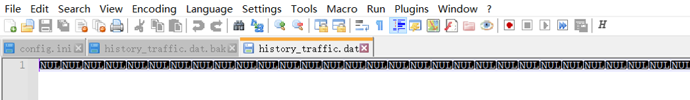

### 已知问题

* #### 在少数情况下，任务栏窗口会显示不全，比如单位被覆盖了

  这个问题通常出现在任务栏右侧通知区域宽度变化的时候，主要在在切换输入法的时候，如果出现了这个问题，可以将通知区任意一个图标向上拖动将其隐藏，再将其拖下来即可恢复正常。

  出现这个问题原因在于，系统任务栏通知区的图标数量可能会发生变化，导致通知区的宽度也会时常变化，当通知区的宽度发生变化时，TrafficMonitor的任务栏窗口需要实时调整其位置。但是由于我无法知道通知区的宽度在什么时候变化，因此只能每隔一段时间判断是否需要调整位置，如果任务栏通知区域的宽度变化得太快，就会导致TrafficMonitor的任务栏无法及时调整其位置，从而导致了这个BUG。

* #### 在Windows10中，如果在“设置”-“轻松使用”-“颜色滤镜”中开启了“反转”等颜色滤镜，则请勿使用TrafficMonitor的“设置”-“任务栏窗口设置”-“根据任务栏颜色自动设置背景色”的功能。

  因为“根据任务栏颜色自动设置背景色”这个功能的原理是每隔一秒取一次任务栏上显示的颜色，并将其设置为TrafficMonitor任务栏窗口的背景颜色。如果在Windows设置中开启了反转颜色，那么TrafficMonitor取到的任务栏颜色就是反转过的颜色，将此颜色设置为背景色后显示出来的颜色是再次被反转的颜色。

* #### TrafficMonitor的任务栏窗口和某个软件（名字忘记了）的“在任务栏显示空白”功能有冲突，会导致两个软件“争夺”任务栏空间，导致任务栏中所有按钮消失。

  如果遇到这种情况，建议关闭“在任务栏显示空白”功能，或者关闭TrafficMonitor的任务栏窗口。

* #### 硬件监控功能相关问题

  据部分用户反馈，开启硬件监控功能会导致System进程始终占用10%左右的CPU（[[BUG\]升级Win10 21H1后，system的CPU占用率一直在10%左右，即使机器是空闲的 · Issue #652 · zhongyang219/TrafficMonitor (github.com)](https://github.com/zhongyang219/TrafficMonitor/issues/652)）。

  据部分用户反馈，开启硬件监控功能会导致TrafficMonitor内存占用异常（[1.80.3占用内存会越来越大！ · Issue #716 · zhongyang219/TrafficMonitor (github.com)](https://github.com/zhongyang219/TrafficMonitor/issues/716)）。

  据部分用户反馈，在硬件监控中开启显卡监控会导致游戏黑屏和死机问题。

* #### Windows11系统下，开启“根据任务栏颜色自动设置背景色”选项时，桌面Netflix应用全屏时会黑屏。

* #### 在极少数情况下，配置文件和历史流量记录文件丢失

  据部分用户反馈，在某些情况下，会出现配置文件和历史流量记录文件丢失的问题。具体表现为，在程序某次启动时，所有配置被重置到了初始状态，经检查配置和数据文件发现，文件大小没有发生变化，但是文件内容全部变成0，如下图所示：

  

  目前暂时不清楚出现此问题的原因，建议及时备份配置文件，以便在出现问题时能恢复之前的配置。

