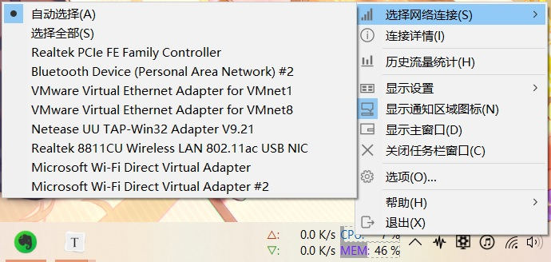

**[简体中文](选择监控的网络连接) | English**

You can select the current monitoring network connections in the "Select Network Connections" submenu of the main window or taskbar window context menu.

You can select one of the connection to monitor.

Or you can select "Auto" to make program to select the network connection you are currently using automatically.

#### Auto Select

When selecting "Auto Select", the program will take the one with the largest sum of sent and received bytes of all connections as the current monitoring connection.

If there are connections disconnected or new network connections connected, the program will automatically update the list under the "Select Network Connections" submenu, and write the information "The connection number change has been detected, the connection has been retrieved" to the log file.

At this time, if you are selecting "Auto Select", the auto select operation will be performed once, or the program will try to select the network connection selected before.

Even if you are already selecting the "Auto Select", you can still select "Auto Select" to perform the auto select operation once.

#### Select All

When selecting "Select All", TrafficMonitor will monitor the total traffic of all network connections in the list.

If you checked "Show all network connections" option in "[Options - General Settings -  Advanced](Option-Settings#Advanced)", "Select All" will not be available.

