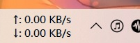
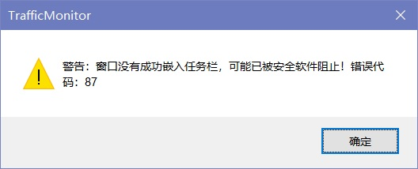
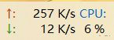

**[简体中文](任务栏窗口) | English**

### Taskbar window description

TrafficMonitor can also be displayed in the taskbar. By default, the taskbar window is not displayed, if you want to display the monitor information in the taskbar, you can right click the main window, select "Show  Taskbar Window", then the taskbar window will be displayed on the right side of the taskbar.

By default, only net speed is displayed in the taskbar window, if you want to display the CPU and memory usage, you can right click the taskbar window, select "Display setting" in the context menu, and check the items that you want to displayed.

Like the main window, a mouse tool tip will be displayed when the mouse points to the taskbar window.

The taskbar window supports many customization functions, such as changing fonts, specifying text colors for each item, changing background colors, background transparency, horizontal arrangement, right alignment of values, and so on. See the [Option Settings - Taskbar Window Settings](Option-Settings#Taskbar-Window-Settings) section for details.

A context menu will be displayed when right-click the taskbar window, as shown in the picture above, most of the functions in the context menu is the same as which in the main window context menu.  Please refer to the "[Context Menu](Context-Menu)" section for details.

> Note: TrafficMonitor embeds the window into the taskbar by setting it as a child window of the taskbar. In some cases, this may lead to the failure of the embedded taskbar. Currently, there are two known cases:
>
> 1. Blocked by third-party security software
>
>    Some security software will block this behaver of software, which can cause the window embed to the taskbar not properly.
>
> 2. When the start menu is open.
>
>    In Windows10, if the start menu is open, the taskbar window cannot embed into the taskbar. This is a known issue.
>
> In this case, TrafficMonitor will make several attempts to embed into the taskbar, and if it still fails, an error message will pop up:
>
> 

Normally, items in a taskbar window are displayed in a two-line format. If an odd number of items are displayed, the last item will be arranged vertically, as shown below:

